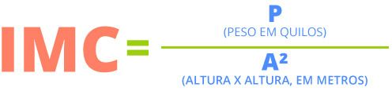

# IMC - Índice de Massa Corporal

### Calcula o IMC

IMC: Você sabe calcular seu peso adequado?
O Índice de Massa Corporal (IMC) é a principal maneira de
descobrir se você está com peso ideal ou se apresenta magreza,
sobrepeso ou obesidade.

Qual é a recomendação de IMC feita pela Organização Mundial de Saúde OMS a população?
Valores de IMC abaixo de 18,5: adulto com baixo peso. Valores de IMC maior ou igual a 18,5 e menor que 25,0: adulto com peso adequado (eutrófico). Valores de IMC maior ou igual a 25,0 e menor que 30,0: adulto com sobrepeso. Valores de IMC maior ou igual a 30,0: adulto com obesidade.

Fonte:
<a href="https://www.gov.br/saude/pt-br/assuntos/saude-brasil/eu-quero-ter-peso-saudavel/noticias/2017/imc-voce-sabe-calcular-seu-peso-adequado" target="_blank">Ministério da Saúde</a>

#### Variáveis usadas:

      pc = Peso Corporal
      alt = Altura
      IMC = Índice de massa corporal
